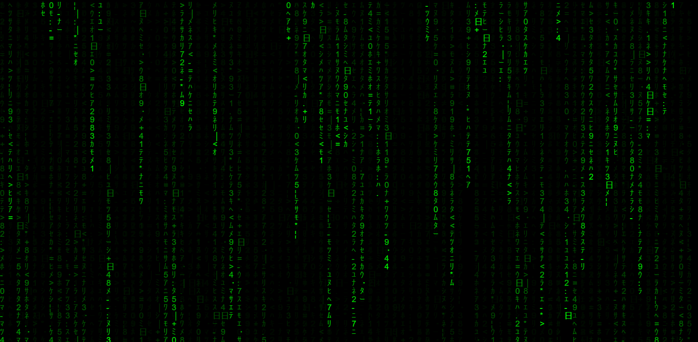

# Matrix Rain

## Keys
- `! @ # $ % ^ & * (` change letters to a specific color
- `)` changes letters to a random color
- `Arrow up/down` decreases/increases the speed of the letters
- `W/S` increases/decreases the number of characters
- `Space` permanently increases the speed of letters
- `R` sets/unsets rainbow color effect

## Credits
- [Willian Justen Matrix Rain tutorial](https://willianjusten.com.br/criando-o-efeito-da-chuva-do-matrix-com-javascript-puro) is the base of the code. I fixed some small problems and extended it, implementing all the functionality of the keys above. You can find the original code [here](https://github.com/willianjusten/labs/blob/main/matrix-rain/index.html).
